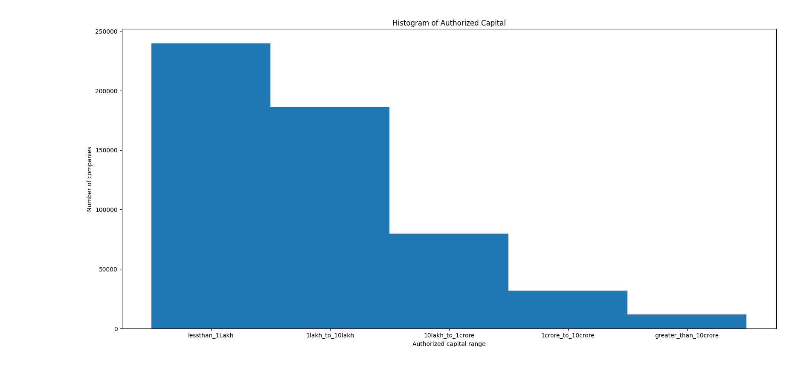
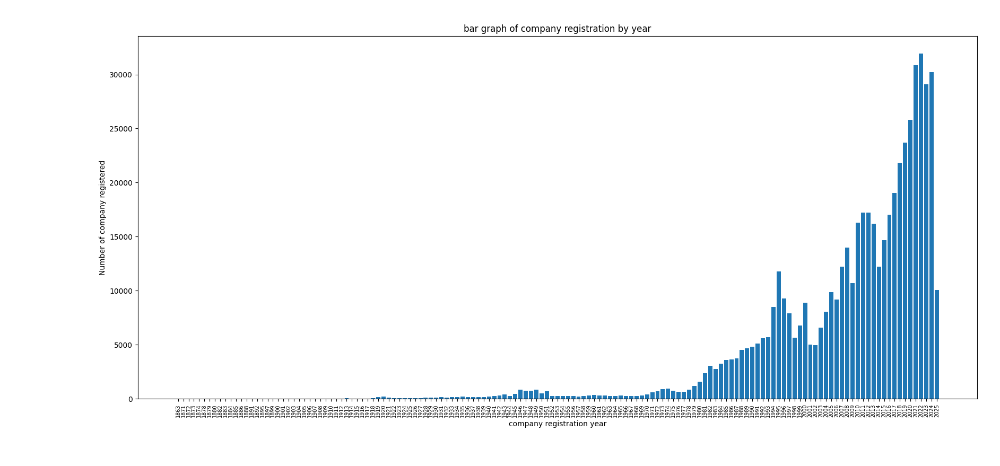
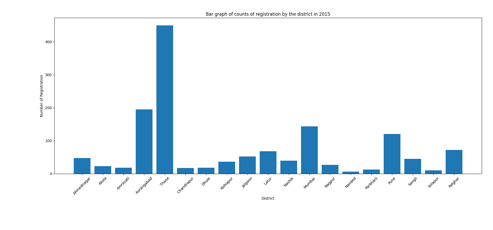
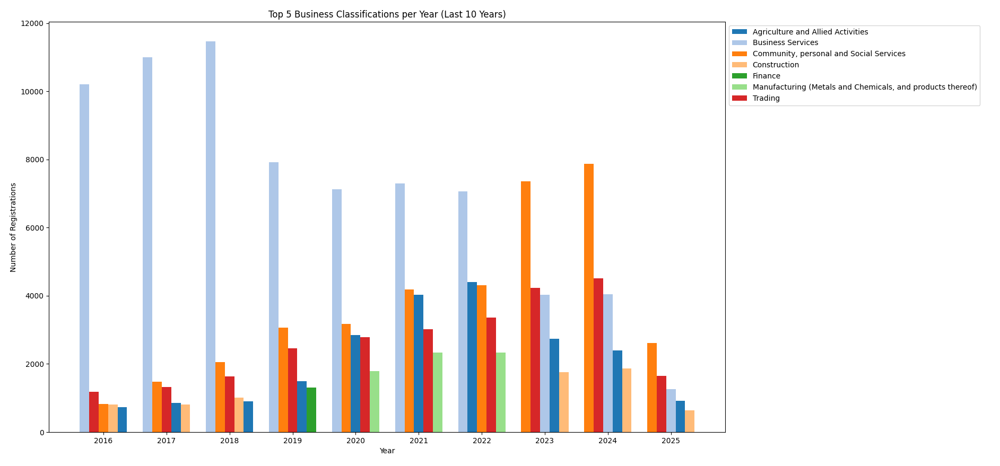

---

### How to Run the Project

#### 1. Clone the repository

```bash
git clone git@github.com:DwipenduKundu/company-master-data_analysis.git
cd company-master-data_analysis
```

#### 2. Set up a virtual environment (recommended)

```bash
python -m venv venv
#linux
source venv/bin/activate     
# On Windows: venv\Scripts\activate
```

#### 3. Install dependencies

```bash
pip install -r requirements.txt
```

#### 4. Extract the Data(Required)


Go to data_set folder and extract the data.csv.gz file

```bash
gunzip data.csv.gz
```

#### 5. Run the script

##### go through the answers now

---


# Task:
###  Company Master - Maharashtra

#### Aim
To convert raw open data into plots, that tell a story on the state of company registration in Maharashtra.

#### raw data

| Name                               | source                                          |
|------------------------------------|-------------------------------------------------|
| Company master data of Maharashtra | https://data.gov.in/catalog/company-master-data |


#### Instructions

1. Download all the data needed. Consult your mentor if you have any problems accessing the raw data.
1. Initialize a python project with a separate virtualenv. All your code should be in Python.
1. **Important**: flake8 should not throw any errors.
2. This project should have a separate repo on Gitlab.com.
3. All projects should have README.md with instructions on how to run this project.

##### What your program should do

From the CSV and other source files specified above, write python code to ...
1. Read in the data.
2. Write logic to slice / dice / accumulate / transform the data.
3. Using matplotlib plot the plots specified in the following section.

#### Problems

##### 1. Histogram of Authorized Cap

Plot a histogram on the "Authorized Capital" (column: AUTHORIZED_CAP) with the following intervals

  1. <= 1L
  2. 1L to 10L
  3. 10L to 1Cr
  4. 1Cr to 10Cr
  5. \> 10Cr

**Note:**
* The x-axis labels should be strings listed above, like "<= 1L".
* You will have to adjust the intervals if you have an un-balanced plot.

##### 2. Bar Plot of company registration by year

From the column, DATE_OF_REGISTRATION parse out the registration year. Using this data, plot a **bar plot** of the number of company registrations, vs. year.

##### 3. Company registration in the year 2015 by the district.

The district can be found by zip code. This [resource](https://www.goldenchennai.com/pin-code/maharashtra-postal-code/) has that data. Before you start on this problem please make a CSV of zip code vs. district.

In this exercise ...

  1. Only consider registrations for the year 2015.
  2. Find out the district of registration by the zip code. The zip code can be found at the end of the address column.
  3. Count the registration by the district.
  3. Plot a "Bar plot" of "Number of Registration" vs. district.
  4. If the plot is unbalanced consider plotting only the top districts.

##### 4. Grouped Bar Plot.

Plot a Grouped Bar Plot by aggregating registration counts over ...
  1. Year of registration
  2. Principal Business Activity

Plot only top 5 Prinicipal Business Activity for last 10 years

An example of a Grouped Bar Plot is [here](https://matplotlib.org/3.1.1/gallery/lines_bars_and_markers/barchart.html)


# Answer:
##### 1 Histogram of Authorized Cap


Open comapny1.py and run the script run() function will take care of everything.




##### 2. Bar Plot of company registration by year

Open comapny2.py and run the script run() function will take care of everything.



##### 3. Company registration in the year 2015 by the district.

Open comapny3.py and run the script run() function will take care of everything.



##### 4. Grouped Bar Plot.

Open comapny4.py and run the script run() function will take care of everything.
